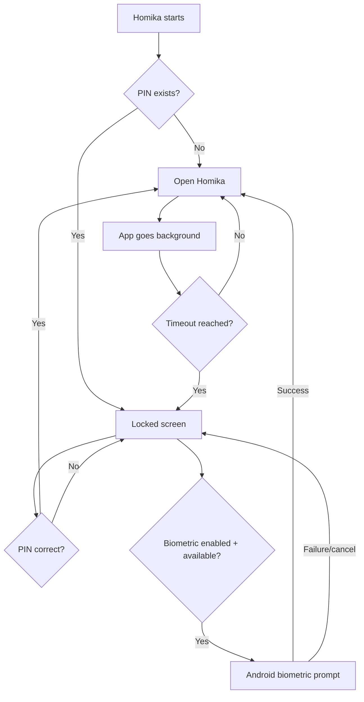

# Homika Flowchart

This file indexes the core operational flows.

## 18. App lock flow

```mermaid
flowchart TD
    A[Homika starts] --> B{PIN exists?}
    B -- No --> C[Open Homika]
    B -- Yes --> D[Locked screen]
    D --> E{PIN correct?}
    E -- Yes --> C
    E -- No --> D
    D --> F{Biometric enabled + available?}
    F -- Yes --> G[Android biometric prompt]
    G -- Success --> C
    G -- Failure/cancel --> D
    C --> H[App goes background]
    H --> I{Timeout reached?}
    I -- Yes --> D
    I -- No --> C
```
